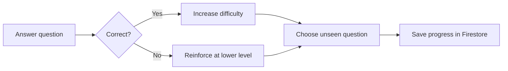

<div align="center">

# NeuraQuiz

### Adaptive learning, measurable progress, and subject mastery

[](https://neuraquiz-2026.web.app/)


[Live Application](https://neuraquiz-2026.web.app/) · [Report an Issue](https://github.com/Student-Keval2627/adaptive-ai-quiz-system/issues)

</div>

## Overview

NeuraQuiz is a full-stack adaptive quiz platform for computer science learners.
It adjusts question difficulty from the learner's answers, prioritizes unseen
questions, revisits mistakes, and tracks progress toward complete subject
mastery.

The production application runs entirely on Firebase's no-cost Spark plan.
Firebase Authentication handles accounts, Cloud Firestore stores private user
data, and Firebase Hosting serves the React application and question bank. The
original Flask and MongoDB backend remains available for local development.

## Key features

- Email and password registration, login, logout, and protected routes
- Adaptive difficulty that moves between Low, Mid, and High levels
- Fixed-difficulty practice and weak-topic focus mode
- Non-repeating mastered questions; incorrect answers remain available for review
- Attempt validation and duplicate-result protection
- Per-subject progress, result history, accuracy, XP, levels, and daily streaks
- Topic analytics and automatic weak-topic detection
- Low-level milestone after mastering all 300 Easy questions in a subject
- Printable certificate after mastering all 1,000 questions in a subject
- Responsive dashboard for desktop and mobile devices

## Question bank

| Specification | Value |
| --- | ---: |
| Subjects | 25 |
| Questions per subject | 1,000 |
| Low (`Easy`) | 300 per subject |
| Mid (`Medium`) | 400 per subject |
| High (`Hard`) | 300 per subject |
| Total questions | 25,000 |

Every question contains four unique options and exactly one validated answer.
The production JSON files live in `server/data/questions`. During development
and production builds, `client/scripts/copy-question-bank.mjs` copies them into
the generated public directory and creates a subject manifest.

## How adaptation works

1. A new adaptive quiz starts at the Easy level.
2. A correct answer moves the next selection toward a higher difficulty.
3. An incorrect answer moves toward reinforcement at a lower difficulty.
4. Unseen, unmastered questions are always preferred.
5. Incorrect questions return only after suitable unseen questions are exhausted.
6. Focus mode prioritizes topics with the learner's largest retry queue.



## Architecture

| Layer | Production | Optional local mode |
| --- | --- | --- |
| Frontend | React 19 + Vite | React 19 + Vite |
| Authentication | Firebase Authentication | Flask session authentication |
| Data | Cloud Firestore | MongoDB with PyMongo |
| Question delivery | Static JSON on Firebase Hosting | Flask API |
| Hosting | Firebase Hosting | Local Flask/Vite servers |

When `VITE_API_BASE` is empty, the client uses Firebase mode. Setting it to a
Flask server URL switches the same interface to the original REST API.

## Firestore data model

All application records are stored below the authenticated user's document:

```text
users/{userId}
├── attempts/{attemptId}
├── results/{attemptId}
├── subjectProgress/{subjectSlug}
└── certificates/{subjectSlug}
```

The included Firestore rules restrict every profile and nested record to its
owner. All unmatched reads and writes are denied.

## Run locally with Firebase

### Prerequisites

- Node.js 20.19 or newer
- npm
- A Firebase project with Email/Password Authentication and Firestore enabled

### Setup

```powershell
git clone https://github.com/Student-Keval2627/adaptive-ai-quiz-system.git
cd adaptive-ai-quiz-system\client
npm install
npm run dev
```

Open the URL printed by Vite, normally `http://localhost:5173/`.

The repository contains the production Firebase web configuration. To use a
different project, provide these Vite environment variables:

```text
VITE_FIREBASE_API_KEY
VITE_FIREBASE_AUTH_DOMAIN
VITE_FIREBASE_PROJECT_ID
VITE_FIREBASE_STORAGE_BUCKET
VITE_FIREBASE_MESSAGING_SENDER_ID
VITE_FIREBASE_APP_ID
```

## Deploy to Firebase Hosting

The hosting target is `neuraquiz-2026`, while the Firebase project that owns
Authentication and Firestore is `neuraquiz-keval-2026`.

```powershell
cd E:\Quiz\client
npm install
npm test
npm run build

cd E:\Quiz
firebase use neuraquiz-keval-2026
firebase deploy --only firestore:rules,hosting
```

After deployment, open [https://neuraquiz-2026.web.app/](https://neuraquiz-2026.web.app/).

## Optional Flask and MongoDB mode

### Start the backend

```powershell
cd E:\Quiz
python -m venv .\server\venv
& ".\server\venv\Scripts\Activate.ps1"
python -m pip install -r .\server\requirements.txt
cd .\server
python .\app.py
```

MongoDB defaults to `mongodb://127.0.0.1:27017/` and the
`adaptive_ai_quiz` database. You can override `MONGO_URI`, `MONGO_DB_NAME`,
`SECRET_KEY`, `FLASK_PORT`, and `FLASK_DEBUG` in `server/.env`.

### Start the client in API mode

```powershell
cd E:\Quiz\client
npm install
$env:VITE_API_BASE = "http://127.0.0.1:5000"
npm run dev
```

To return to Firebase mode in the same terminal:

```powershell
Remove-Item Env:VITE_API_BASE -ErrorAction SilentlyContinue
npm run dev
```

## Verification

Run the full validation suite from the repository root:

```powershell
python .\server\scripts\verify_question_bank_v2.py
python -m unittest discover -s .\server\tests -v

cd .\client
npm test
npm run build
```

The strict bank verifier checks subject files, required fields, difficulty
counts, answer validity, option uniqueness, and duplicate questions.

## Project structure

```text
adaptive-ai-quiz-system/
├── client/                  React and Vite application
│   ├── scripts/             Question-bank build preparation
│   ├── src/pages/           Quiz and account screens
│   └── src/services/        Firebase, analytics, and bank services
├── server/                  Optional Flask and MongoDB backend
│   ├── data/questions/      Validated 25,000-question source bank
│   ├── models/              Data access and quiz logic
│   ├── routes/              REST API blueprints
│   ├── scripts/             Bank generation and verification
│   └── tests/               Python unit tests
├── firebase.json            Hosting and SPA routing configuration
├── firestore.rules          Per-user Firestore access rules
└── README.md
```

## Spark-plan security note

The Firebase deployment intentionally avoids paid server infrastructure. Quiz
selection, answer checking, and result verification therefore run in the
browser, and the hosted question JSON can be inspected by a determined user.
Firestore rules protect users from accessing one another's data, but this mode
does not provide server-enforced anti-cheat. Use the Flask backend or another
trusted server runtime when tamper-resistant assessment is required.

## Author

Developed by **Keval Radadiya** —
[@Student-Keval2627](https://github.com/Student-Keval2627)
